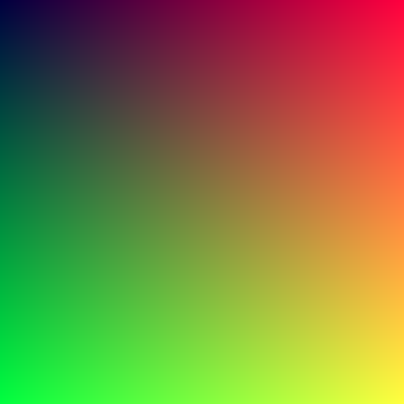

# Hello World

This is my home page! My name is Jonathan Aslam and I am a student at [Cal State Fullerton](http://www.fullerton.edu/) and my major is Computer Science.

## Computer Science Projects

My GitHub page is http://github.com/JonathanAslam.

### CPSC 120

* Lab 7

    I really enjoyed working on Lab 7, Part 2. It was the first time I had implemented functions into a C++ program and I was very excited to use functions to help my programs become more efficient. I was also very facinated by the concept of black jack and the way certain cards like the Ace can have different point values in different situation. Overall a very enjoyable program to write. 

* Lab 8

    Lab 8, Part 3 was the first time that I had written a animation in C++. At first, it was tricky to understand what some of the aspects of the program's function were, but after time I was able to piece together how any why the program was able to function. I found this lab to be enjoyable mainly because of how unlike some of the other programs which involved user inputs and would output values and responses, this program simply just displayed a animation and was very creative. 

* Lab 10

    In Lab 10, Part 3, we were tasked to write a program that would make a gradient image using RGB values. It was a more complex program compared to many of the other ones we had in previous weeks, but the main reason I chose this to be one of my favorites is because this program layed the foundation for future creativity in terms of graphics through coding. In the lecture we were showed the basic graidient picuters, but our lecutre professor also showed a code which was able to be put onto a business card and displayed a very detailed image with reflective surfaces and other features that just amazed me. Overall, part 3 of lab 10 was a good project to show the applications of programming for graphic design which I loved. 

